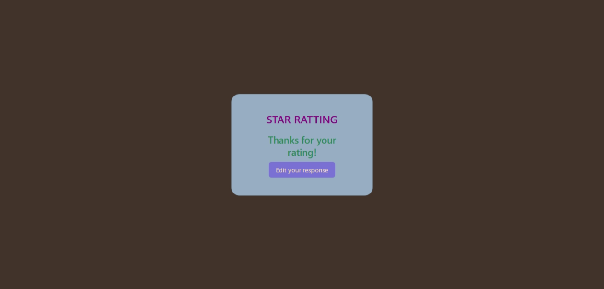

# ⭐ Star Rating System

This is a simple and interactive Star Rating UI using HTML, CSS, and JavaScript. It allows users to rate content using stars and then shows a "Thank you" message with an option to edit their response.

---

## 🔗 Live Demo

👉 [Click here to view the live project](https://your-live-link-here)

---

## 🎯 Features

- Users can give a rating from 1 to 5 stars ⭐⭐⭐⭐⭐
- After rating, a thank you message is shown
- An option to edit the rating is available
- Responsive design using pure CSS and Font Awesome icons

---

## 🖼️ Output Screenshots

### 🖼️ Initial Star Rating View

### 🖼️ After Rating Submitted

### 🖼️ Edit Response View

> Add your other screenshots as `output-2.png`, `output-3.png` in the project folder

---

---

## 💻 Tech Stack

- HTML5
- CSS3
- JavaScript
- [Font Awesome](https://fontawesome.com/) for star icons

---

## 🔍 How It Works

- When a star is clicked, it's selected using radio buttons.
- Clicking the "Rate It" button hides the star widget and shows a "Thank You" message.
- Clicking "Edit your response" shows the star rating again to update the input.

---

## 🙋‍♂️ Author

**Dhinesh Kumar**  
🔗 [GitHub Profile](https://github.com/msdhinesh45)

---

## 📜 License

Free for educational and personal use.

---

